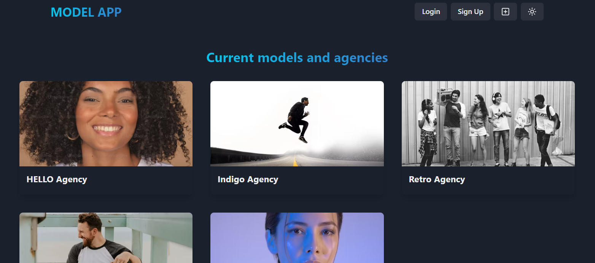

# MERN Model App



## Setup .env file
```
MONGO_URI=your_mongo_uri
PORT=5000
SECRET_KEY=your secret key
API_URL = /api/v1/
```

## Run db seeders
```
npm run seed
```

## Run this app locally
```
npm run prod
```